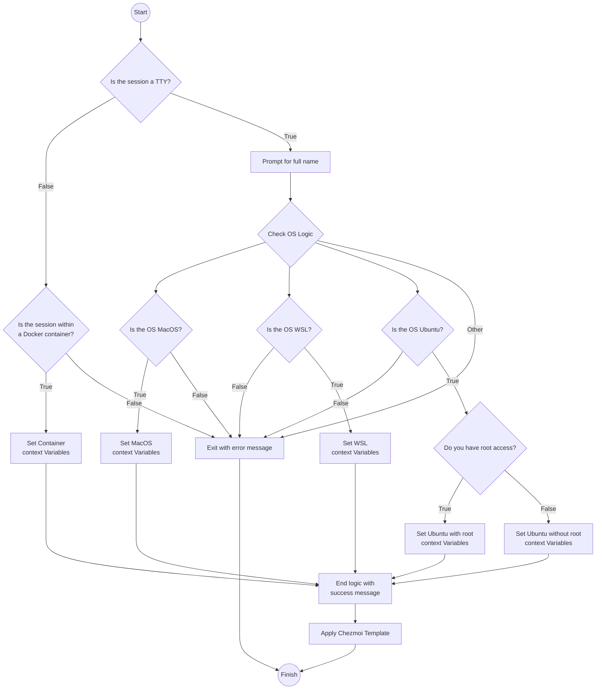

# Dotfiles

## Description

Opinionated dotfiles for \*nix based personal and work development environments,
managed by [Chezmoi](https://www.chezmoi.io).

## Installation

**Requirements:**

1. Ubuntu (VM, Baremetal or WSL) or MacOS target operating system
2. curl installed in target operating system

**Run:**

```bash
sh -c "$(curl -fsLS get.chezmoi.io/lb)" -- init --apply arrrgi [--branch main|development]
```

## Dotfiles Decision Tree

Chezmoi runs context/OS specific scripts and applies relevant dotfiles using the
high-level logic outlined.



This could be interpreted as the following pseudo-Bash script which minimises
the number of nested condition statements by using guard clauses. This aligns
closely to the way the Chezmoi base template evaluates conditions, captures
necessary inputs from _**stdin**_ during installation and then executes context
and OS specific scripts and config to the target environment.

```bash
#!/bin/bash

echo "Start"
echo "-----"

# Check if the session is a TTY
echo "Is this a TTY session? (y/n)"
read is_tty

if [ "$is_tty" == "n" ]; then
    # Check if the session is within a Docker container
    echo "Is the session within a Docker container? (y/n)"
    read is_container

    if [ "$is_container" == "y" ]; then
        # Set container context variables
        echo "Setting Container context variables..."
        # Perform necessary operations

        echo "End logic with success message"
        echo "Apply Chezmoi Template"
    else
        echo "Exit with error message"
        echo "Finish"
    fi
else
    echo "Is the OS MacOS? (y/n)"
    read is_macos

    if [ "$is_macos" == "y" ]; then
        # Set MacOS context variables
        echo "Setting MacOS context variables..."
        # Perform necessary operations

        echo "End logic with success message"
        echo "Apply Chezmoi Template"
    elif [ "$is_macos" == "n" ]; then
        echo "Is the OS WSL? (y/n)"
        read is_wsl

        if [ "$is_wsl" == "y" ]; then
            # Set WSL context variables
            echo "Setting WSL context variables..."
            # Perform necessary operations

            echo "End logic with success message"
            echo "Apply Chezmoi Template"
        else
            echo "Is the OS Ubuntu? (y/n)"
            read is_ubuntu

            if [ "$is_ubuntu" == "y" ]; then
                echo "Do you have root access? (y/n)"
                read has_root_access

                if [ "$has_root_access" == "y" ]; then
                    # Set Ubuntu context variables with root
                    echo "Setting Ubuntu with root context variables..."
                    # Perform necessary operations

                    echo "End logic with success message"
                    echo "Apply Chezmoi Template"
                elif [ "$has_root_access" == "n" ]; then
                    # Set Ubuntu context variables without root
                    echo "Setting Ubuntu without root context variables..."
                    # Perform necessary operations

                    echo "End logic with success message"
                    echo "Apply Chezmoi Template"
                else
                    echo "Exit with error message"
                    echo "Finish"
                fi
            else
                echo "Exit with error message"
                echo "Finish"
            fi
        fi
    else
        echo "Exit with error message"
        echo "Finish"
    fi
fi
```

## License

MIT
