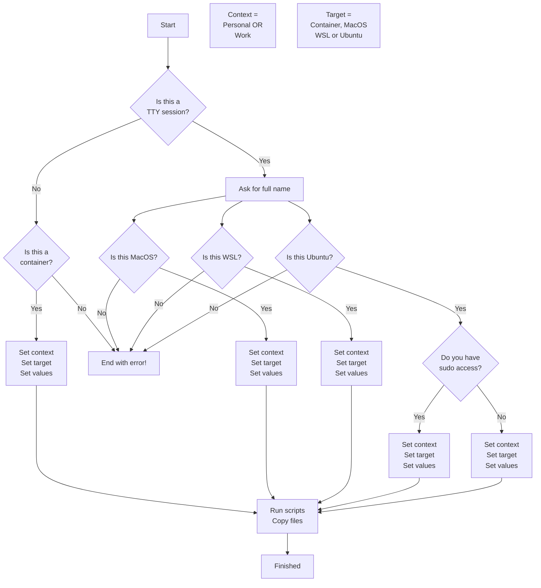

# Dotfiles

## Description

Opinionated dotfiles for \*nix based personal and work development environments,
managed by [Chezmoi](https://www.chezmoi.io).

## Installation

**Requirements:**

1. Ubuntu (VM, Baremetal or WSL) or MacOS target operating system
2. curl installed in target operating system

**Run:**

```bash
sh -c "$(curl -fsLS get.chezmoi.io/lb)" -- init --apply arrrgi [--branch main|development]
```

## Dotfiles Decision Tree

Chezmoi runs context/OS specific scripts and applies relevant dotfiles using the
high-level logic outlined.



This could be interpreted as the following pseudo-Bash script which minimises
the number of nested condition statements by using guard clauses. This aligns
closely to the way the Chezmoi base template evaluates conditions, captures
necessary inputs from _**stdin**_ during installation and then executes context
and OS specific scripts and config to the target environment.

Additional detail on the conditional logic and inputs required is available in
the [documentation](https://dotfiles.bald.engineer) for this repo.

```bash
#!/bin/bash

# Check if not in a TTY session
if [ ! -t 0 ]; then
    # Not in a TTY session - Check if within a container
    if grep -q "docker" /proc/1/cgroup; then
        # Within a container - LoadContainerConfig
        echo "Setting context, target, and values within a container"
    else
        # Not within a container - Error
        echo "Error: Not in a TTY session and not within a container"
    fi
    exit
fi

# Ask for the user's full name
echo "Please enter your full name:"
read full_name

# Determine the user's platform
if [ "$(uname)" == "Darwin" ]; then
    # MacOS - LoadMacOSConfig
    echo "Setting context, target, and values for $full_name on MacOS"
    exit
fi

if [ -f "/proc/version" ] && grep -qi "Microsoft" /proc/version; then
    # WSL - LoadWSLConfig
    echo "Setting context, target, and values for $full_name on WSL"
    exit
fi

if [ "$(lsb_release -is)" == "Ubuntu" ]; then
    # Ubuntu - Check sudo access
    if sudo -n true 2>/dev/null; then
        # Ubuntu with sudo access - LoadRootConfig
        echo "Setting context, target, and values for $full_name on Ubuntu (sudo)"
    else
        # Ubuntu without sudo access - LoadRootlessConfig
        echo "Setting context, target, and values for $full_name on Ubuntu (no sudo)"
    fi
    exit
fi

# Other platform - Error
echo "Error: Unsupported platform"
```

## License

MIT
